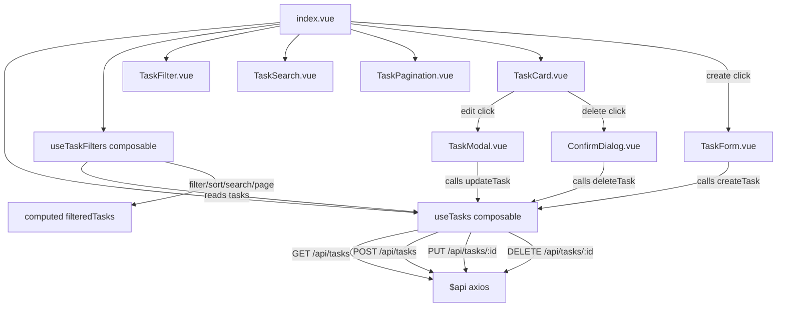

# Design Document: Tasks CRUD

## Overview

Фича реализует полный CRUD для задач в Nuxt 3 ToDo-приложении (SSR отключён). Пользователь может просматривать список задач с фильтрацией, сортировкой, поиском и пагинацией, создавать, редактировать и удалять задачи с учётом ролевых прав.

Ключевые ограничения:
- SSR отключён — все composables работают только на клиенте
- MSW v1.x (legacy API: `rest` из `msw`)
- TypeScript strict mode
- `$api` — axios-инстанс из плагина `axios.ts`, доступен через `useNuxtApp()`
- `useAuth` уже реализован, предоставляет `user`, `isAdmin`
- Тестирование через Vitest + `@fast-check/vitest`

---

## Architecture



Поток данных:
1. `index.vue` монтируется → вызывает `useTasks().fetchTasks()`
2. `useTasks` хранит сырой список задач в `useState('tasks')`
3. `useTaskFilters` принимает реактивный список задач и параметры (filter, sort, search, page) → возвращает `filteredTasks` (computed)
4. Компоненты `TaskCard` получают задачу и флаги `canEdit`/`canDelete` (вычисляются через `useAuth`)
5. Мутации (create/update/delete) идут через `useTasks`, который обновляет локальный стор после успешного ответа API

---

## Components and Interfaces

### `src/composables/useTasks.ts`

```typescript
interface TasksState {
  tasks: Task[]
  isLoading: boolean
  error: string | null
}

interface UseTasks {
  tasks: ComputedRef<Task[]>
  isLoading: ComputedRef<boolean>
  error: ComputedRef<string | null>
  fetchTasks(): Promise<void>
  createTask(payload: CreateTaskPayload): Promise<void>
  updateTask(id: number, payload: UpdateTaskPayload): Promise<void>
  deleteTask(id: number): Promise<void>
}

interface CreateTaskPayload {
  Title: string
  Description?: string
  DueDate?: string
  IsCompleted?: boolean
}

interface UpdateTaskPayload {
  Title: string
  Description?: string
  DueDate?: string
  IsCompleted?: boolean
}
```

`useState('tasks-store')` используется как глобальный реактивный стор. Перед PUT/DELETE выполняется клиентская проверка прав: если `user.id !== task.OwnerId && !isAdmin` — операция отклоняется с ошибкой без отправки запроса.

### `src/composables/useTaskFilters.ts`

```typescript
type FilterOption = 'all' | 'active' | 'completed' | 'overdue'
type SortOption = 'default' | 'dueDate_asc' | 'dueDate_desc' | 'status'

interface UseTaskFilters {
  filter: Ref<FilterOption>
  sort: Ref<SortOption>
  search: Ref<string>
  debouncedSearch: Ref<string>  // обновляется с задержкой 300ms
  currentPage: Ref<number>
  pageSize: Ref<number>         // default: 10
  filteredTasks: ComputedRef<Task[]>   // результат после filter+sort+search
  paginatedTasks: ComputedRef<Task[]>  // срез для текущей страницы
  totalPages: ComputedRef<number>
  setFilter(f: FilterOption): void    // сбрасывает currentPage → 1
  setSort(s: SortOption): void        // сбрасывает currentPage → 1
  setSearch(s: string): void          // сбрасывает currentPage → 1
  setPage(p: number): void
}
```

Debounce реализуется через `setTimeout`/`clearTimeout` внутри `watch` на `search`. При изменении `filter`, `sort` или `debouncedSearch` — `currentPage` сбрасывается в 1.

### `src/components/TaskCard.vue`

Props:
```typescript
interface Props {
  task: Task
  canEdit: boolean
  canDelete: boolean
}
```
Emits: `edit`, `delete`

Отображает: Title, Description (truncated), DueDate, статус (IsCompleted). Кнопки edit/delete рендерятся только при `canEdit`/`canDelete`.

### `src/components/TaskForm.vue`

Props:
```typescript
interface Props {
  loading?: boolean
  error?: string | null
}
```
Emits: `submit(payload: CreateTaskPayload)`, `cancel`

Локальное состояние: `title`, `description`, `dueDate`, `isCompleted`, `titleError`. Валидация: Title не может быть пустым или состоять только из пробелов.

### `src/components/TaskModal.vue`

Props:
```typescript
interface Props {
  task: Task
  loading?: boolean
  error?: string | null
}
```
Emits: `submit(payload: UpdateTaskPayload)`, `close`

Те же поля и валидация, что и `TaskForm`. При открытии поля инициализируются значениями из `task`.

### `src/components/ConfirmDialog.vue`

Props:
```typescript
interface Props {
  message?: string
  loading?: boolean
  error?: string | null
}
```
Emits: `confirm`, `cancel`

### `src/components/TaskFilter.vue`

Props: нет (использует `useTaskFilters` напрямую или через v-model)
Emits: `update:filter(FilterOption)`, `update:sort(SortOption)`

Отображает select/кнопки для выбора фильтра и сортировки.

### `src/components/TaskSearch.vue`

Props: нет
Emits: `update:search(string)`

Текстовый input. Debounce обрабатывается в `useTaskFilters`.

### `src/components/TaskPagination.vue`

Props:
```typescript
interface Props {
  currentPage: number
  totalPages: number
}
```
Emits: `update:page(number)`

Рендерится только если `totalPages > 1`.

---

## Data Models

### Task (существующий интерфейс из `tasks.data.ts`)

```typescript
interface Task {
  Id: number
  Title: string
  Description: string
  DueDate: string       // ISO date string, e.g. '2026-02-15'
  IsCompleted: boolean
  OwnerId: number
}
```

### CreateTaskPayload

```typescript
interface CreateTaskPayload {
  Title: string
  Description?: string
  DueDate?: string
  IsCompleted?: boolean
}
```

### UpdateTaskPayload

```typescript
interface UpdateTaskPayload {
  Title: string
  Description?: string
  DueDate?: string
  IsCompleted?: boolean
}
// Поля Id и OwnerId не обновляются через PUT
```

### TasksState (внутри useState)

```typescript
interface TasksState {
  tasks: Task[]
  isLoading: boolean
  error: string | null
}
```

### FilterOption / SortOption

```typescript
type FilterOption = 'all' | 'active' | 'completed' | 'overdue'
// 'overdue': IsCompleted === false && DueDate < new Date().toISOString().slice(0, 10)

type SortOption = 'default' | 'dueDate_asc' | 'dueDate_desc' | 'status'
// 'default': порядок из API (по Id)
// 'status': сначала активные (IsCompleted=false), затем выполненные
```

### MSW handlers (обновление `tasks.handlers.ts`)

Добавляются два обработчика:

```typescript
// PUT /api/tasks/:id
// - 401 если нет валидного токена
// - 404 если задача не найдена
// - 403 если user не Owner и не Admin
// - 200 + обновлённая Task если всё ок

// DELETE /api/tasks/:id
// - 401 если нет валидного токена
// - 404 если задача не найдена
// - 403 если user не Owner и не Admin
// - 204 если всё ок
```

---

## Correctness Properties

*A property is a characteristic or behavior that should hold true across all valid executions of a system — essentially, a formal statement about what the system should do. Properties serve as the bridge between human-readable specifications and machine-verifiable correctness guarantees.*

### Property 1: Список задач отображает корректное количество карточек

*For any* массива задач, возвращённого API, количество отрендеренных `TaskCard` должно равняться длине этого массива.

**Validates: Requirements 1.3**

---

### Property 2: Флаг загрузки активен во время запроса

*For any* вызова `fetchTasks()`, значение `isLoading` должно быть `true` пока запрос не завершён и `false` после завершения (успешного или с ошибкой).

**Validates: Requirements 1.2**

---

### Property 3: Ошибка API сохраняется в сторе

*For any* HTTP-ответа с кодом ошибки (не 401), после завершения запроса `error` в `useTasks` должен содержать непустую строку с описанием ошибки.

**Validates: Requirements 1.5, 2.6, 3.7, 4.5**

---

### Property 4: Пустой Title не проходит валидацию

*For any* строки, состоящей только из пробельных символов или пустой строки, переданной как Title, форма (TaskForm или TaskModal) должна отклонить отправку и не вызывать API.

**Validates: Requirements 2.3, 3.4**

---

### Property 5: Создание задачи — round-trip

*For any* валидного `CreateTaskPayload`, после успешного POST запроса задача, возвращённая сервером, должна присутствовать в локальном списке задач, а длина списка должна увеличиться на 1.

**Validates: Requirements 2.4, 2.5**

---

### Property 6: Видимость кнопок edit/delete зависит от прав

*For any* задачи и любого пользователя, кнопки edit и delete должны отображаться тогда и только тогда, когда `user.id === task.OwnerId` ИЛИ `user.role === 'admin'`. Для всех остальных пользователей кнопки не должны рендериться.

**Validates: Requirements 3.1, 4.1, 5.1, 5.2**

---

### Property 7: Модальное окно редактирования предзаполнено данными задачи

*For any* задачи, при открытии `TaskModal` все поля формы должны содержать текущие значения этой задачи (Title, Description, DueDate, IsCompleted).

**Validates: Requirements 3.2**

---

### Property 8: Обновление задачи — round-trip

*For any* задачи в списке и валидного `UpdateTaskPayload`, после успешного PUT запроса задача в локальном списке должна содержать обновлённые значения, а длина списка должна остаться неизменной.

**Validates: Requirements 3.5, 3.6**

---

### Property 9: Удаление задачи убирает её из списка

*For any* задачи в списке, после успешного DELETE запроса задача с данным Id не должна присутствовать в локальном списке, а длина списка должна уменьшиться на 1.

**Validates: Requirements 4.3, 4.4**

---

### Property 10: Отмена диалога не изменяет список

*For any* состояния списка задач, после отмены `ConfirmDialog` список задач должен остаться идентичным исходному, и никакой HTTP-запрос не должен быть отправлен.

**Validates: Requirements 4.6**

---

### Property 11: Сортировка возвращает корректный порядок

*For any* непустого массива задач и любой опции сортировки, результат `sortTasks(tasks, sortOption)` должен удовлетворять соответствующему предикату порядка (по DueDate asc/desc, по IsCompleted, по Id).

**Validates: Requirements 6.2**

---

### Property 12: Фильтр возвращает только подходящие задачи

*For any* массива задач и любой опции фильтра, все задачи в результате `filterTasks(tasks, filterOption)` должны удовлетворять предикату фильтра, и ни одна задача, не удовлетворяющая предикату, не должна присутствовать в результате.

**Validates: Requirements 7.2**

---

### Property 13: Поиск нечувствителен к регистру

*For any* массива задач и любой строки поиска S, все задачи в результате `searchTasks(tasks, S)` должны иметь Title, содержащий S (case-insensitive), и ни одна задача без такого вхождения не должна присутствовать в результате.

**Validates: Requirements 8.3**

---

### Property 14: Debounce поиска — 300ms

*For any* ввода в поле поиска, фильтр задач не должен применяться до истечения 300ms после последнего нажатия клавиши.

**Validates: Requirements 8.2**

---

### Property 15: Очистка поиска восстанавливает полный список

*For any* состояния поиска с непустой строкой S, после очистки поля поиска (S → '') результирующий список должен совпадать с результатом применения только активного фильтра и сортировки без поиска.

**Validates: Requirements 8.5**

---

### Property 16: Идемпотентность поискового фильтра

*For any* массива задач и любой строки поиска S, `searchTasks(searchTasks(tasks, S), S)` должен быть равен `searchTasks(tasks, S)`.

**Validates: Requirements 8.6**

---

### Property 17: Пагинация возвращает корректный срез

*For any* отфильтрованного и отсортированного массива задач длиной N, страницы размером P и номера страницы K, `paginatedTasks` должен содержать задачи с индексами `[(K-1)*P, K*P)` из массива, и не более P задач.

**Validates: Requirements 9.1, 9.3**

---

### Property 18: Видимость пагинации зависит от количества задач

*For any* отфильтрованного массива задач, элементы управления пагинацией должны отображаться тогда и только тогда, когда `filteredTasks.length > pageSize`.

**Validates: Requirements 9.2, 9.5**

---

### Property 19: Изменение фильтра/сортировки/поиска сбрасывает страницу на 1

*For any* текущей страницы > 1, после изменения любого из параметров (filter, sort, search) `currentPage` должен стать равным 1.

**Validates: Requirements 9.4**

---

### Property 20: MSW PUT обновляет только разрешённые поля

*For any* задачи T и валидного `UpdateTaskPayload`, после PUT запроса поля `Id` и `OwnerId` задачи должны остаться неизменными, а поля Title, Description, DueDate, IsCompleted должны принять значения из payload.

**Validates: Requirements 10.7**

---

### Property 21: MSW PUT идемпотентен

*For any* задачи T и валидного `UpdateTaskPayload` P, двойной вызов PUT с одним и тем же P должен привести к тому же состоянию задачи в хранилище, что и однократный вызов.

**Validates: Requirements 10.8**

---

### Property 22: MSW возвращает 403 для неавторизованных мутаций

*For any* PUT или DELETE запроса от пользователя, который не является Owner задачи и не имеет роли admin, MSW handler должен вернуть статус 403.

**Validates: Requirements 5.3, 5.4**

---

## Error Handling

| Сценарий | Поведение |
|---|---|
| GET /api/tasks — сетевая ошибка | `error` в `useTasks` = сообщение об ошибке, список пуст |
| GET /api/tasks — 401 | Axios interceptor: очистка токена + редирект на `/login` |
| POST /api/tasks — ошибка | `TaskForm` показывает ошибку, остаётся открытой |
| PUT /api/tasks/:id — ошибка | `TaskModal` показывает ошибку, остаётся открытой |
| DELETE /api/tasks/:id — ошибка | `ConfirmDialog` показывает ошибку |
| PUT/DELETE — нет прав (клиент) | `useTasks` отклоняет операцию с ошибкой, запрос не отправляется |
| MSW PUT/DELETE — 403 | Ошибка передаётся в соответствующий компонент |
| MSW PUT/DELETE — 404 | Ошибка "Task not found" передаётся в компонент |
| Пустой Title | Валидационная ошибка под полем, запрос не отправляется |
| Список задач пуст (после загрузки) | Empty-state сообщение в `index.vue` |
| Фильтр/поиск даёт пустой результат | Empty-state сообщение, специфичное для активного фильтра/поиска |

Все ошибки API отображаются в виде строки. Во время запроса кнопки submit задизейблены (`loading` prop).

---

## Testing Strategy

### Инструменты

- **Vitest** — тест-раннер (уже настроен, `jsdom` environment)
- **@fast-check/vitest** — property-based тестирование (`@fast-check/vitest@^0.3.0`, `fast-check@^4.6.0`)
- **MSW v1.x** — мокирование HTTP в тестах (уже настроен в `src/tests/setup.ts`)

### Подход

Двойная стратегия: unit-тесты для конкретных примеров и граничных случаев + property-тесты для универсальных свойств.

**Unit-тесты** (`src/tests/unit/`):
- `tasks-util.test.ts` — конкретные примеры для `filterTasks`, `sortTasks`, `searchTasks`
- Граничные случаи: пустой список, задача без DueDate, overdue-фильтр на границе дат
- MSW handlers: 401 без токена, 404 для несуществующего id, 403 для чужой задачи

**Property-тесты** (`src/tests/unit/tasks.property.test.ts`):
- Каждый тест запускается минимум 100 итераций (fast-check default: 100)
- Каждый тест помечен комментарием:
  `// Feature: tasks-crud, Property N: <property_text>`
- Каждое корректностное свойство реализуется одним property-based тестом

### Маппинг property-тестов

| Property | Генераторы fast-check |
|---|---|
| P1: Список рендерит N карточек | `fc.array(taskArb)` |
| P2: isLoading во время запроса | `taskArb`, fake timers |
| P3: Ошибка API в сторе | `fc.constantFrom(400, 403, 404, 500)` |
| P4: Пустой Title отклоняется | `fc.string().filter(s => s.trim() === '')` |
| P5: POST round-trip | `createPayloadArb` |
| P6: Видимость кнопок | `fc.record({ userId: fc.integer(), ownerId: fc.integer(), role: fc.constantFrom('admin','user') })` |
| P7: Модал предзаполнен | `taskArb` |
| P8: PUT round-trip | `taskArb`, `updatePayloadArb` |
| P9: DELETE убирает задачу | `fc.array(taskArb, { minLength: 1 })` |
| P10: Отмена не меняет список | `fc.array(taskArb)` |
| P11: Сортировка корректна | `fc.array(taskArb)`, `fc.constantFrom(...sortOptions)` |
| P12: Фильтр корректен | `fc.array(taskArb)`, `fc.constantFrom(...filterOptions)` |
| P13: Поиск case-insensitive | `fc.array(taskArb)`, `fc.string()` |
| P14: Debounce 300ms | `fc.string()`, fake timers |
| P15: Очистка поиска | `fc.array(taskArb)`, `fc.string({ minLength: 1 })` |
| P16: Идемпотентность поиска | `fc.array(taskArb)`, `fc.string()` |
| P17: Пагинация — срез | `fc.array(taskArb, { minLength: 1 })`, `fc.integer({ min: 1 })` |
| P18: Видимость пагинации | `fc.array(taskArb)`, `fc.integer({ min: 1, max: 20 })` |
| P19: Сброс страницы | `fc.integer({ min: 2 })`, изменение filter/sort/search |
| P20: PUT обновляет только поля | `taskArb`, `updatePayloadArb` |
| P21: PUT идемпотентен | `taskArb`, `updatePayloadArb` |
| P22: MSW 403 для чужих задач | `taskArb`, `userArb` (не owner, не admin) |

### Баланс тестов

Unit-тесты покрывают конкретные сценарии (успешный CRUD, конкретные ошибки, граничные случаи дат). Property-тесты обеспечивают покрытие широкого диапазона входных данных для логики фильтрации, сортировки, поиска и пагинации. Компонентные тесты (рендеринг, видимость кнопок) используют конкретные примеры, а не property-тесты, так как тестируют UI-поведение.
