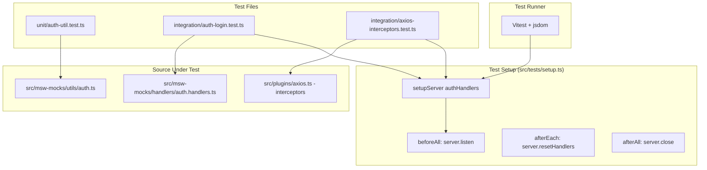

# Design Document

## Overview

Фича добавляет тестовую инфраструктуру на базе Vitest в существующий Nuxt 3 проект (SSR отключён, `srcDir: 'src/'`) и покрывает тестами слой авторизации: утилиту `getUserFromAuthHeader`, MSW-обработчик `POST /api/auth/login` и интерцепторы axios-плагина.

Ключевые решения:
- Vitest запускается в окружении `jsdom` (не `happy-dom`) для совместимости с `localStorage` API.
- MSW v1.x `setupServer` из `msw/node` используется в Node-окружении тестов — без Service Worker.
- Axios-плагин (`src/plugins/axios.ts`) тестируется в изоляции: экземпляр `axios.create` создаётся напрямую, без Nuxt-контекста; `navigateTo` мокируется через `vi.mock`.
- Nuxt auto-imports (`defineNuxtPlugin`, `navigateTo`) мокируются глобально в `setupFiles`, чтобы тесты не падали с "not defined".

## Architecture



Поток выполнения:
1. Vitest загружает `vitest.config.ts`, применяет алиасы `~`/`@` → `src/`.
2. Перед запуском тестов выполняется `src/tests/setup.ts` — создаётся MSW-сервер с `authHandlers`.
3. `beforeAll` вызывает `server.listen({ onUnhandledRequest: 'error' })`.
4. Каждый тест выполняется; интеграционные тесты делают HTTP-запросы через `fetch`/`axios`, которые перехватывает MSW.
5. `afterEach` сбрасывает переопределения обработчиков.
6. `afterAll` закрывает сервер.

## Components and Interfaces

### vitest.config.ts

```typescript
import { defineConfig } from 'vitest/config'
import { resolve } from 'path'

export default defineConfig({
  test: {
    environment: 'jsdom',
    setupFiles: ['src/tests/setup.ts'],
    include: ['src/**/*.test.ts'],
  },
  resolve: {
    alias: {
      '~': resolve(__dirname, 'src'),
      '@': resolve(__dirname, 'src'),
    },
  },
})
```

### src/tests/setup.ts

Глобальный файл инициализации. Отвечает за:
- Создание MSW-сервера с `authHandlers`.
- Управление жизненным циклом сервера (`beforeAll` / `afterEach` / `afterAll`).
- Мок Nuxt auto-imports (`navigateTo`, `defineNuxtPlugin`) через `vi.stubGlobal`.

```typescript
import { setupServer } from 'msw/node'
import { authHandlers } from '../msw-mocks/handlers/auth.handlers'
import { beforeAll, afterEach, afterAll, vi } from 'vitest'

export const server = setupServer(...authHandlers)

// Мок Nuxt globals
vi.stubGlobal('navigateTo', vi.fn())
vi.stubGlobal('defineNuxtPlugin', (fn: Function) => fn)

beforeAll(() => server.listen({ onUnhandledRequest: 'error' }))
afterEach(() => server.resetHandlers())
afterAll(() => server.close())
```

### src/tests/unit/auth-util.test.ts

Unit-тесты для `getUserFromAuthHeader`. Не требуют HTTP — тестируют чистую функцию.

Интерфейс тестируемой функции:
```typescript
// src/msw-mocks/utils/auth.ts
function getUserFromAuthHeader(auth?: string): User | null
```

### src/tests/integration/auth-login.test.ts

Интеграционные тесты для `POST /api/auth/login` через MSW. Используют `fetch` напрямую (без axios), чтобы изолировать тест от интерцепторов.

### src/tests/integration/axios-interceptors.test.ts

Тесты интерцепторов axios. Создают изолированный экземпляр `axios.create({ baseURL: '/api' })` с теми же интерцепторами, что и в плагине. `navigateTo` мокируется через `vi.fn()`.

## Data Models

### User (из `src/msw-mocks/data/users.data.ts`)

```typescript
interface User {
  id: number
  email: string
  password: string
  role: 'admin' | 'user'
}
```

Тестовые данные:
| id | email | password | role |
|----|-------|----------|------|
| 1  | admin@test.com | 123456 | admin |
| 2  | user@test.com  | 123456 | user  |

### LoginRequest / LoginResponse

```typescript
// Тело запроса POST /api/auth/login
interface LoginRequest {
  email: string
  password: string
}

// Тело успешного ответа
interface LoginResponse {
  token: string        // String(user.id), например "1"
  user: {
    id: number
    email: string
    role: 'admin' | 'user'
  }
}

// Тело ошибки
interface LoginError {
  message: string      // 'Invalid credentials'
}
```

### Token

Строка, хранимая в `localStorage` под ключом `'token'`. Значение равно `String(user.id)` (например, `"1"` для admin). Используется axios-интерцептором для формирования заголовка `Authorization: Bearer <token>`.

### Структура тестовых файлов

```
src/
  tests/
    setup.ts                              # Глобальная инициализация MSW
    unit/
      auth-util.test.ts                   # Unit-тесты getUserFromAuthHeader
    integration/
      auth-login.test.ts                  # Интеграционные тесты POST /api/auth/login
      axios-interceptors.test.ts          # Тесты интерцепторов axios
```

### npm-скрипты (добавляются в package.json)

```json
{
  "scripts": {
    "test": "vitest --run",
    "test:watch": "vitest"
  }
}
```

### Зависимости (добавляются в devDependencies)

```json
{
  "devDependencies": {
    "vitest": "^1.6.0",
    "jsdom": "^24.0.0",
    "@vitest/coverage-v8": "^1.6.0"
  }
}
```


## Correctness Properties

*A property is a characteristic or behavior that should hold true across all valid executions of a system — essentially, a formal statement about what the system should do. Properties serve as the bridge between human-readable specifications and machine-verifiable correctness guarantees.*

### Property 1: Round-trip getUserFromAuthHeader

*For any* пользователя из `users.data.ts`, вызов `getUserFromAuthHeader("Bearer " + user.id)` должен вернуть объект с `id`, равным `user.id` — то есть токен однозначно идентифицирует пользователя.

**Validates: Requirements 3.1, 3.2, 3.6**

### Property 2: Невалидный ввод возвращает null

*For any* строки, не соответствующей формату `"Bearer <существующий_id>"` (включая `undefined`, пустую строку, `"Bearer 999"` и произвольные строки без совпадения в `users`), `getUserFromAuthHeader` должна вернуть `null`.

**Validates: Requirements 3.3, 3.4, 3.5**

### Property 3: Валидные credentials возвращают корректный ответ

*For any* пользователя из `users.data.ts`, запрос `POST /api/auth/login` с его `email` и `password` должен вернуть статус `200`, `token === String(user.id)` и объект `user` с совпадающими `id`, `email` и `role`.

**Validates: Requirements 4.1, 4.2**

### Property 4: Невалидные credentials возвращают 401

*For any* комбинации `email`/`password`, не совпадающей ни с одним пользователем в `users.data.ts` (включая неверный пароль, несуществующий email, пустое тело), запрос `POST /api/auth/login` должен вернуть статус `401` и тело `{ message: 'Invalid credentials' }`.

**Validates: Requirements 4.3, 4.4, 4.5**

### Property 5: Изоляция переопределений MSW-обработчиков

*For any* теста, который переопределяет обработчик через `server.use(...)`, последующий тест должен видеть оригинальный обработчик из `authHandlers` — переопределение не должно «протекать» между тестами.

**Validates: Requirements 2.3, 2.5, 4.6**

### Property 6: Токен в localStorage определяет заголовок Authorization

*For any* значения токена в `localStorage`: если токен присутствует, каждый исходящий запрос через `Axios_Instance` должен содержать заголовок `Authorization: Bearer <token>`; если токен отсутствует — заголовок `Authorization` не должен присутствовать в запросе.

**Validates: Requirements 5.1, 5.2**

### Property 7: Статус ответа определяет вызов navigateTo

*For any* ответа со статусом `401`, `Axios_Instance` должен вызвать `navigateTo('/login')` ровно один раз; *for any* ответа со статусом `200`, `navigateTo` не должен вызываться.

**Validates: Requirements 5.3, 5.4**

---

## Error Handling

### Неперехваченные запросы

MSW-сервер настроен с `onUnhandledRequest: 'error'` — любой запрос, не совпадающий ни с одним обработчиком, немедленно провалит тест с понятным сообщением. Это предотвращает ситуацию, когда тест молча проходит, делая реальные HTTP-запросы.

### Ошибки авторизации (401)

Axios-интерцептор перехватывает `401` и вызывает `navigateTo('/login')`. В тестах `navigateTo` мокируется через `vi.stubGlobal('navigateTo', vi.fn())` в `setup.ts`, чтобы избежать зависимости от Nuxt-роутера. После каждого теста мок сбрасывается через `vi.clearAllMocks()` в `afterEach`.

### Невалидные входные данные в getUserFromAuthHeader

Функция обрабатывает `undefined` и пустую строку через ранний возврат `null`. Токены, не соответствующие ни одному `user.id`, также возвращают `null` (через `Array.find` → `undefined` → `|| null`).

### Переопределения обработчиков

`server.resetHandlers()` в `afterEach` гарантирует, что переопределения через `server.use(...)` внутри теста не влияют на другие тесты. Тесты, использующие `server.use`, должны вызывать его внутри тела теста (не в `beforeEach`), чтобы сброс работал корректно.

### TypeScript strict mode

Все тестовые файлы используют строгую типизацию. Импорты типов из `users.data.ts` выполняются через `import type`. Ответы MSW типизируются явно, чтобы избежать `any`.

---

## Testing Strategy

### Подход: два уровня тестирования

Используется комбинация unit-тестов (конкретные примеры и edge-cases) и property-based тестов (универсальные свойства над множеством входных данных).

**Unit-тесты** (`src/tests/unit/`, `src/tests/integration/`):
- Конкретные примеры корректного поведения (admin login, user login).
- Edge-cases: пустое тело, несуществующий email, `undefined`-токен.
- Интеграционные точки: axios-интерцепторы с реальным MSW-сервером.

**Property-based тесты** (`@fast-check/vitest`):
- Универсальные свойства, применимые ко всему пространству входных данных.
- Минимум 100 итераций на каждый property-тест.
- Каждый тест аннотирован комментарием с номером свойства из design.md.

### Библиотека property-based тестирования

Используется **`@fast-check/vitest`** — официальная интеграция fast-check с Vitest. Предоставляет `test.prop` и `fc` (fast-check) напрямую в тестах.

```bash
npm install --save-dev @fast-check/vitest fast-check
```

### Структура тестов

```
src/tests/
  setup.ts                                  # MSW server + Nuxt globals mocks
  unit/
    auth-util.test.ts                       # P1, P2 — getUserFromAuthHeader
  integration/
    auth-login.test.ts                      # P3, P4, P5 — POST /api/auth/login
    axios-interceptors.test.ts              # P6, P7 — axios interceptors
```

### Аннотации property-тестов

Каждый property-тест содержит комментарий в формате:
```
// Feature: vitest-auth-testing, Property N: <краткое описание свойства>
```

Пример:
```typescript
// Feature: vitest-auth-testing, Property 1: Round-trip getUserFromAuthHeader
test.prop([fc.integer({ min: 1, max: 2 })])('round-trip token resolution', (id) => {
  const user = getUserFromAuthHeader(`Bearer ${id}`)
  expect(user?.id).toBe(id)
})
```

### Покрытие свойств тестами

| Property | Тип теста | Файл |
|----------|-----------|------|
| P1: Round-trip getUserFromAuthHeader | property (fast-check) | unit/auth-util.test.ts |
| P2: Невалидный ввод → null | property (fast-check) + edge-cases | unit/auth-util.test.ts |
| P3: Валидные credentials → 200 | property (fast-check) | integration/auth-login.test.ts |
| P4: Невалидные credentials → 401 | property (fast-check) | integration/auth-login.test.ts |
| P5: Изоляция переопределений MSW | example | integration/auth-login.test.ts |
| P6: Токен ↔ заголовок Authorization | property (fast-check) | integration/axios-interceptors.test.ts |
| P7: 401 → navigateTo, 200 → без navigateTo | example | integration/axios-interceptors.test.ts |

### Конфигурация fast-check

```typescript
// Минимум 100 итераций для каждого property-теста
fc.configureGlobal({ numRuns: 100 })
```

### Запуск тестов

```bash
# Однократный запуск (CI)
npm run test

# Режим наблюдения (разработка)
npm run test:watch
```
